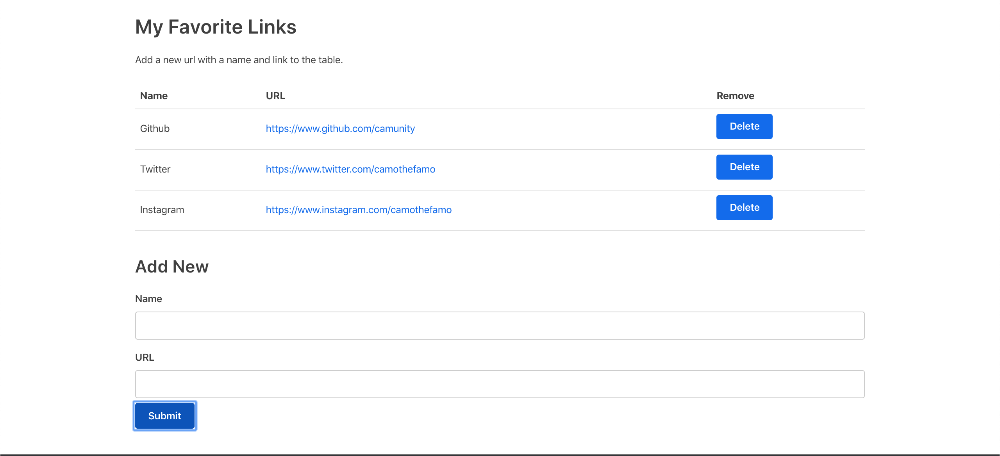

# CMP 464 – HW 2

**Due Date:** 10/07/2020 by EOD

**Submission Type:** Google Form

**Grading:** Letter Grade

**Topics:** Command Line, Git, React (Components, State, Props, JSX), Javascript

## Rationale

Now that we've had time to dive into the fundamentals of [React.JS](https://reactjs.org) let's test your knowledge of the fundamentals and create our first React app!

## Aims and Outcomes 
### Aims
This homework is designed to test your ability to clone a React project and use Git for managing your project changes.

### Specific Learning Outcomes
By the end of this homework, you will have built your first functional React application. You will render multiple components and create the logic of appending and removing items from a table.

## Set Up Procedures
0) Open the terminal and navigate to a safe file destination (ex: run command `cd ~/Desktop`)
1) In the terminal run the command: `git clone https://github.com/camunity/favLinks.git`
2) cd into the new folder after it's finished cloning
3) run command `npm install`
4) run command `npm start`
5) Open project in VSCode

## What Are We Building? Application Screenshots
We are building a simple React app that will list your favorite links on the Web. You will build a component to add new links with a name, and a component to display these objects in a table. You should be able to delete rows from the table, and click each link. Here is what the final version will look like:

.gif)

.gif)

.gif)

### Component Hierarchy

App (functional component our application renders first)

- LinkContainer (class component holding our input form and link table)

- - Form (class component allowing us to add a new link)

- - Table (functional component allowing us to visualize and remove our links)

- - - TableHeader (functional component of our Table to display header info)

- - - TableBody (functional component of our Table to display our links and delete button)

In this project we're going to use 5 components in addition to our App.js

The initial project contains the file structure you should use and some default code for some of these components and their styling. Your job will be to fill in the missing logic marked in with the `/* TODO */` comment blocks.

### Project Steps:
1. Look through the App.js
2. Look through all of the files in the components folder for TODOs
3. Create a simple Table component in the Table.js 
4. Render your Table component in LinkContainer.js
5. Review the code in TableHeader and TableBody 
6. Change your Table component to render the TableHeader and TableBody components
7. Pass a prop called linkData to your Table component from the LinkContainer component
8. Access and show data passed from LinkContainer in TableBody
9. Create a state object in our LinkContainer to hold an array called favLinks
10. Create a removeLink function in the LinkContainer class that updates the state and removes an item from favLinks
11. Create a prop called removeLink that passes your removeLink function to your Table component
12. Create a button in your TableBody with an onClick that calls this.props.removeLink and passes the index of the table row
13. Create a Form component in your Form.js file with inputs and labels for name and URL
14. Set the initial state of the Form to be an object with empty properties for a link `name` and `URL`
15. Update the state of the Form every time the name or URL field is changed
16. Render the Form component below the Table component in your LinkContainer
17. Create a function called handleSubmit on the LinkContainer to update the state of this.state.favLinks and add new favLink from Form
18. Add the handleSubmit as a parameter to your Form component
19. Create a method called submitForm that calls the handleSubmit and passes the Form data and resets the state of the Form values to be empty
20. Add a submit button to the Form that calls submitForm in its onClick parameter

Review and test the app and celebrate if you've made it this far 🚀

If that all worked congratulations! You built your first functional React project <3 

## Submissions

Upload your finished code to Github and use this [submission link](https://forms.gle/ADjrKPmT51mbJGcf8) to turn in your assignment. 

Send me a message on Slack when you're done! 

## If You Get Stuck

Try troubleshooting your code by re-reading these instructions or researching information on the [W3Schools](https://www.w3schools.com) or [MDN](https://developer.mozilla.org/en-US/) before turning to another member of the class!

For super serious questions or concerns Slack me! 

## Grading 
Student grades for this homework will be as follows:

- **LinkContainer Component (20 pts)**
  - Goals:
    - File was changed correctly
    - Code is well organized and readable

- **Table Component (20 pts)**
  - Intents:
    - File was changed correctly
    - Code is well organized and readable
    
- **Form Component (20 pts)**
  - Intents:
    - File was changed correctly
    - Code is well organized and readable
    
- **Table Header Component (20 pts)**
  - Intents:
    - File was changed correctly
    - Code is well organized and readable
    
- **Table Body Component (20 pts)**
  - Intents:
    - File was changed correctly
    - Code is well organized and readable
    
-	**Extra Credit (10 pts)**
  - Intents:
    - Demonstrate extra knowledge of subject matter

## Academic Integrity

This course observed and upholds the [CUNY Policy on Academic Integrity](http://www.lehman.edu/lehman/about/policies_pdf/CUNYAcademicIntegrityPolicy.pdf) ([Accessible Plain Text](http://www.lehman.edu/lehman/about/policies_pdf/CUNYAcademicIntegrityPolicy.txt)). Each student in this course is expected to abide by this policy. Any work submitted by a student in this course for academic credit will be the student's own work. Collaboration is allowed where assignments are designated as group projects.

You are encouraged to study together and to discuss information and concepts covered in lecture and the sections with other students. You can give "consulting" help to or receive "consulting" help from such students. However, this permissible cooperation should never involve one student having possession of a copy of all or part of work done by someone else, in the form of an e-mail, an e-mail attachment file, a diskette, or a hard copy. 

Should copying occur, both the student who copied work from another student and the student who gave material to be copied will both automatically receive a zero for the assignment. Penalty for violation of this Code can also be extended to include failure of the course and University disciplinary action. 

During examinations, you must do your own work. Talking or discussion is not permitted during the examinations, nor may you compare papers, copy from others, or collaborate in any way. Any collaborative behavior during the examinations will result in failure of the exam, and may lead to failure of the course and University disciplinary action.

## Reasonable Accommodations and Academic Adjustments

In compliance with [CUNY policy](http://www2.cuny.edu/about/administration/offices/legal-affairs/policies-procedures/reasonable-accommodations-and-academic-adjustments/) ([PDF](http://www2.cuny.edu/wp-content/uploads/sites/4/page-assets/about/administration/offices/legal-affairs/policies-procedures/reasonable-accommodations-and-academic-adjustments/Procedures-for-Implementing-Reasonable-Accommodations-9.21.2016.pdf)) and equal access laws, I am available to discuss appropriate academic accommodations that may be required for student with disabilities.

## Inclusivity Statement

We understand that our members represent a rich variety of backgrounds and perspectives. The Computer Science department is committed to providing an atmosphere for learning that respects diversity. While working together to build this community we ask all members to:
*	share their unique experiences, values and beliefs
*	be open to the views of others 
*	honor the uniqueness of their colleagues
*	appreciate the opportunity that we have to learn from each other in this community
*	value each other's opinions and communicate in a respectful manner
*	keep confidential discussions that the community has of a personal (or professional) nature 
*	use this opportunity together to discuss ways in which we can create an inclusive environment in this course and across the CUNY community
