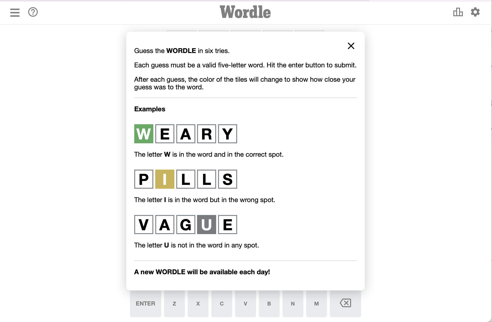
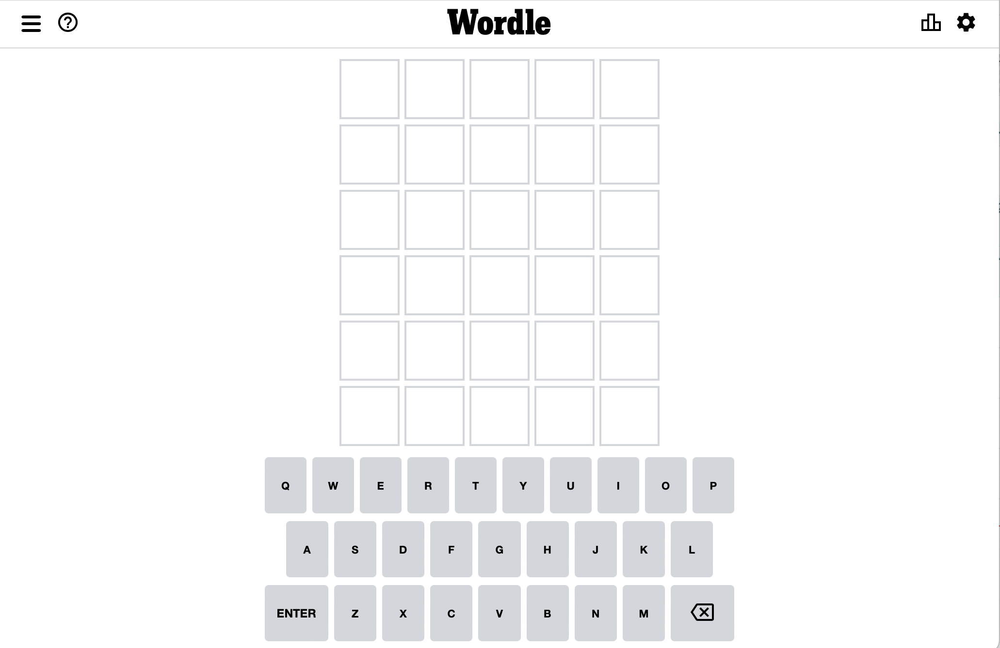

# CMP 464 – HW 3

**Due Date:** 04/22/2022

**Submission Type:** Team or Individual

**Grading:** Letter Grade

**Topics:** Command Line, Git, React (Components, State, Props, JSX), Javascript, CSS

## Rationale

We've now built a functional React application demonstrating important React fundamentals such as: Class vs Functional components, State & Props, Event Handling, and Array functions. Let's continue our learning, and try to build a new React app with similar features as small groups.

## Aims and Outcomes

### Aims

This homework is designed to test your ability to create a React project based on a design reference and use Git for managing your project changes as a team.

### Specific Learning Outcomes

By the end of this homework, you will have built not only your second functional React application but an actual game to be proud of. You will render multiple components and create the logic for conditional rendering using state.

You can work on this homework in groups of up to 3 people. Feel free to use the Slack to find and coordinate with your teammates.

## Setting Up a Group Repo on Github

0. Check in with your group and designate one person to create the project repository.
1. That person should go to github and fork the repository at `https://github.com/464squad/design-pad`
2. In the new forked repo click on Settings > Manage Access
3. Click the green button that says Invite a Collaborator
4. Input your teammates' github usernames to add them to the team repo
5. Everyone should now `git clone` the repo and should be able to push/pull to your team's forked repo.
6. Make sure everyone is set up and can run the project before proceeding.

## What Are We Building? Application Screenshots

You will be building a very popular game that has taken the internet by storm this year! It's called [Wordle](https://www.nytimes.com/games/wordle/index.html)

The game is very simple. The user gets 6 tries to guess a 5 letter word that is pre-defined. The game requires the user to click a keyboard and submit their choice, it changes color to show if they guessed any correct letters and if that letter is in the correct place. The game continues until the user guesses the right word or runs out of turns.

[Here is a video explanation of the game and hw](https://us02web.zoom.us/rec/share/LwZzN6me5pOg07ptL6xZ_w4yiVHLqvgVuzdTYGtWSL_WwptCK7xJUAYCmJNi9ec7.KAEJP-ikTe8qbGpi)

### How Should You Approach This Build?

1. Break down the Wordle game into potential components you can conceptualize rebuilding in React.

2. Think about what kind of data needs to be stored and which components will need to make use of that data.

3. Determine which if any components need to use state or receive props.

4. Build a piece at a time and get basic functionality before focusing on more of the nitty-gritty styling.

5. Make sure you're using git to commit often so if you make a mistake you can get back on track!

### Organization

Make a new folder called `components` inside of your `src` folder to save any of your custom components. Make a new folder called `css` inside of the `src` folder to save any of your component styling files. Instead of giving you project boilerplate code, I will allow your team to determine the best way to structure the components you use.

### Suggested Steps:

1. Discuss the a component hierarchy you'll need to use for the application. If you're working solo feel free to create threads in the Slack.
2. Render simple components to ensure you get a simple project structure down.
3. Try to render the keyboard and game board component to the best of your ability with standard JSX elements.
4. Create your event handlers for processing clicks and submitting your answers to the game. (Try to figure out which button or key is being clicked and how to show it on the game board)
5. Use state and props to maintain a reference of each turn's current input
6. Use CSS to dynamically change the color of the tiles based on the word your group chooses to use for your game.
7. Render any extra styling things with CSS.

(Optional) Work on any additional features for extra credit (multiple games, etc.)

Review and test the app and celebrate if you've made it this far 🚀

If that all worked congratulations! As a team you've built your second React project <3

## Submissions

1. Everyone should push the finished code to Github and send a link. If you're in a group only one repo needs to be submitted.
2. Send me a message on Slack when you're done!
3. Each student should also complete this [submission link](https://forms.gle/yfiCHKEhZDmNyxN98).

## Resources That May Help

[Working with a team on Github](https://www.youtube.com/watch?v=MnUd31TvBoU)

[W3Schools](https://www.w3schools.com)

[MDN](https://developer.mozilla.org/en-US/)

[Dynamically changing CSS using State](https://www.andreasreiterer.at/dynamically-add-classes/)

I am available for questions any time on Slack!

## Grading

Student grades for this homework will be as follows:

- **Git Workflow (70 pts)**

  - Intents:

    - Commit messages are descriptive and readable
    - Multiple commits and pushes on the project

- **Code Organization / React Fundamentals (30 pts)**

  - Intents:
    - Code is organized in proper folders
    - Application uses React concepts like State, Props, and Components properly

- **Extra Credit (10 pts)**
- Intents:
  - Demonstrate extra knowledge of subject matter

## Academic Integrity

This course observed and upholds the [CUNY Policy on Academic Integrity](http://www.lehman.edu/lehman/about/policies_pdf/CUNYAcademicIntegrityPolicy.pdf) ([Accessible Plain Text](http://www.lehman.edu/lehman/about/policies_pdf/CUNYAcademicIntegrityPolicy.txt)). Each student in this course is expected to abide by this policy. Any work submitted by a student in this course for academic credit will be the student's own work. Collaboration is allowed where assignments are designated as group projects.

You are encouraged to study together and to discuss information and concepts covered in lecture and the sections with other students. You can give "consulting" help to or receive "consulting" help from such students. However, this permissible cooperation should never involve one student having possession of a copy of all or part of work done by someone else, in the form of an e-mail, an e-mail attachment file, a diskette, or a hard copy.

Should copying occur, both the student who copied work from another student and the student who gave material to be copied will both automatically receive a zero for the assignment. Penalty for violation of this Code can also be extended to include failure of the course and University disciplinary action.

During examinations, you must do your own work. Talking or discussion is not permitted during the examinations, nor may you compare papers, copy from others, or collaborate in any way. Any collaborative behavior during the examinations will result in failure of the exam, and may lead to failure of the course and University disciplinary action.

## Reasonable Accommodations and Academic Adjustments

In compliance with [CUNY policy](http://www2.cuny.edu/about/administration/offices/legal-affairs/policies-procedures/reasonable-accommodations-and-academic-adjustments/) ([PDF](http://www2.cuny.edu/wp-content/uploads/sites/4/page-assets/about/administration/offices/legal-affairs/policies-procedures/reasonable-accommodations-and-academic-adjustments/Procedures-for-Implementing-Reasonable-Accommodations-9.21.2016.pdf)) and equal access laws, I am available to discuss appropriate academic accommodations that may be required for student with disabilities.

## Inclusivity Statement

We understand that our members represent a rich variety of backgrounds and perspectives. The Computer Science department is committed to providing an atmosphere for learning that respects diversity. While working together to build this community we ask all members to:

- share their unique experiences, values and beliefs
- be open to the views of others
- honor the uniqueness of their colleagues
- appreciate the opportunity that we have to learn from each other in this community
- value each other's opinions and communicate in a respectful manner
- keep confidential discussions that the community has of a personal (or professional) nature
- use this opportunity together to discuss ways in which we can create an inclusive environment in this course and across the CUNY community
