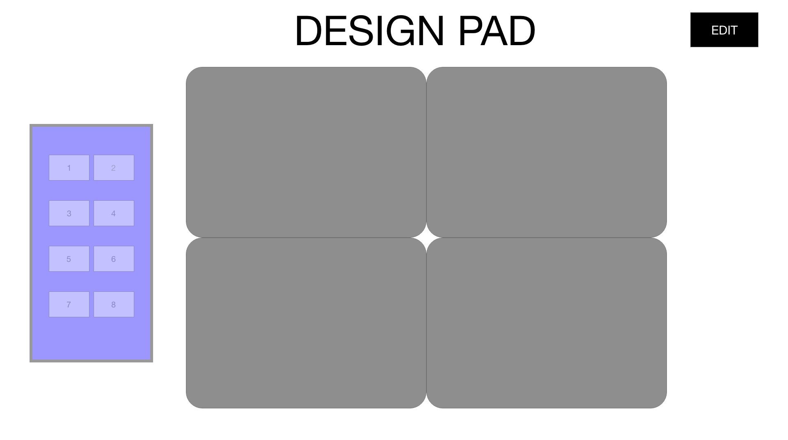
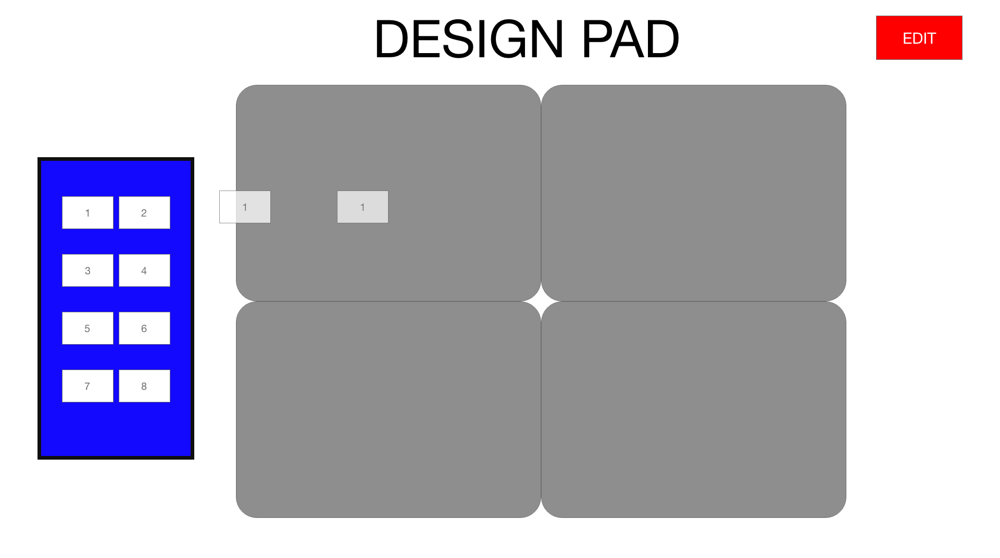

# CMP 464 – HW 3

**Due Date:** 3/30/2020 by 12AM

**Submission Type:** Team - Pull Request, Individual - Google Form

**Grading:** Letter Grade

**Topics:** Command Line, Git, React (Components, State, Props, JSX), Javascript, CSS

## Rationale

We've now built a functional React application demonstrating important React fundamentals such as: Class vs Functional components, State & Props, Event Handling, and Array functions. Let's continue our learning, and try to build a new React app with similar features as small groups.

## Aims and Outcomes 
### Aims
This homework is designed to test your ability to work in groups to create a React project based on a design mockup and use Git for managing your project changes as a team.

### Specific Learning Outcomes
By the end of this homework, you will have built your second functional React application. You will render multiple components and create the logic for conditional rendering using state.

### Teams

Group 1: Ahmed, Jose, Chris *

Group 2: Jenny, Carlos, Kristel

Group 3: Saiful, Omar, Abraham

Group 4: Michael, Manuel, Lillian

Group 5: Artjola, Kaher, Karimu

Group 6: Jonathan, David, James

Group 7: Jeson, Aboubakari, Nathan

Reach out to your team on Slack and start a message group to stay connected.

## Set Up Procedures
0) Check in with your group and designate one person to create the project repository.
1) That person should go to github and fork the repository at `https://github.com/464squad/design-pad`
2) In the new forked repo click on Settings > Manage Access
3) Click the green button that says Invite a Collaborator
4) Input your teammates' github usernames to add them to the team repo
4) Everyone should now `git clone` the repo and should be able to push/pull to your team's forked repo.  
4) Make sure everyone is set up and can run the project before proceeding.

## What Are We Building? Application Screenshots
We are building a simple React app that will be a design pad. Users will be able to drag-and-drop inputs to change your design pads when it is in EDIT mode. Your application will use state to dynamically render the pads to show some change after any drag and drop is performed. Your application doesn't need to look exactly like the following wireframe but should have similar functionality.

### Component Hierarchy

App (functional component our application renders first)

- DesignContainer (component holding our PadInput, the Edit button and the DesignBoard)

- - PadInput (component holding 8 color choice items for the pads)

- - DesignBoard (component holding our Design Pads)

- - - Design Pad (component that is a container displaying some PadInput)

In this project we're going to use 4 components in addition to our App.js

Make a new folder called `components` inside of your `src` folder and save these components there. Instead of giving you project boilerplate code, I will allow your team to determine the best way to structure the components.

### Suggested Steps:
1. Discuss the a component hierarchy you'll need to use for the application
2. Create a project management resource (on Trello, Asana, Google Docs, or another platform) to stay updated as a team
3. Discuss your team's understanding of Git and how to push changes collaboratively
4. Render your pads in the DesignBoard
5. Render your PadInputs Container
6. Create your event handlers for drag-and-drop functionality between PadInputs and each pad. (Try to figure out which input is being dragged and which pad it drops on using console.logs)
7. Use state and props to maintain a reference of each Pad's current input and pass it from the Design Container
8. Use CSS to dynamically change the color of the pads based on the pad input it receives.
9. Render the Edit Button and use state to toggle it on and off / change its properties using CSS.
10. Create the logic to only allow design pads to be changed if the edit button's mode is 'on'
(Optional) Work on any additional features for extra credit

Review and test the app and celebrate if you've made it this far 🚀

If that all worked congratulations! As a team you've built your second React project <3 

## Submissions

1. Your team should push the finished code to Github and submit a Pull Request back to the original repo. 
2. Send me a message on Slack when you're done! 
3. Each member should also complete this [submission link](https://docs.google.com/forms/d/e/1FAIpQLSdWtkEb7ICdVwQ8D6oEvYXsc5Q1t8U8wk1RkdeyyMGHa-Pnaw/viewform). 

## Resources That May Help

[Working with a team on Github](https://www.youtube.com/watch?v=MnUd31TvBoU)

[W3Schools](https://www.w3schools.com) 

[MDN](https://developer.mozilla.org/en-US/)

[Drag and Drop in HTML](https://www.w3schools.com/html/html5_draganddrop.asp)

[Dynamically changing CSS using State](https://www.andreasreiterer.at/dynamically-add-classes/)

I am available for questions any time on Slack!

## Grading 
Student grades for this homework will be as follows:

- **DesignContainer Component (15 pts)**
  - Goals:
    - Code is well organized and readable

- **PadInput Component (15 pts)**
  - Intents:
    - Code is well organized and readable
    
- **DesignBoard Component (15 pts)**
  - Intents:
    - Code is well organized and readable
    
- **DesignPad Component (15 pts)**
  - Intents:
    - Code is well organized and readable
    
- **Git Workflow (40 pts)**
  - Intents:
    - Commit messages are descriptive and readable
    - Multiple commits and pushes on the project
    
-	**Extra Credit (10 pts)**
  - Intents:
    - Demonstrate extra knowledge of subject matter

## Academic Integrity

This course observed and upholds the [CUNY Policy on Academic Integrity](http://www.lehman.edu/lehman/about/policies_pdf/CUNYAcademicIntegrityPolicy.pdf) ([Accessible Plain Text](http://www.lehman.edu/lehman/about/policies_pdf/CUNYAcademicIntegrityPolicy.txt)). Each student in this course is expected to abide by this policy. Any work submitted by a student in this course for academic credit will be the student's own work. Collaboration is allowed where assignments are designated as group projects.

You are encouraged to study together and to discuss information and concepts covered in lecture and the sections with other students. You can give "consulting" help to or receive "consulting" help from such students. However, this permissible cooperation should never involve one student having possession of a copy of all or part of work done by someone else, in the form of an e-mail, an e-mail attachment file, a diskette, or a hard copy. 

Should copying occur, both the student who copied work from another student and the student who gave material to be copied will both automatically receive a zero for the assignment. Penalty for violation of this Code can also be extended to include failure of the course and University disciplinary action. 

During examinations, you must do your own work. Talking or discussion is not permitted during the examinations, nor may you compare papers, copy from others, or collaborate in any way. Any collaborative behavior during the examinations will result in failure of the exam, and may lead to failure of the course and University disciplinary action.

## Reasonable Accommodations and Academic Adjustments

In compliance with [CUNY policy](http://www2.cuny.edu/about/administration/offices/legal-affairs/policies-procedures/reasonable-accommodations-and-academic-adjustments/) ([PDF](http://www2.cuny.edu/wp-content/uploads/sites/4/page-assets/about/administration/offices/legal-affairs/policies-procedures/reasonable-accommodations-and-academic-adjustments/Procedures-for-Implementing-Reasonable-Accommodations-9.21.2016.pdf)) and equal access laws, I am available to discuss appropriate academic accommodations that may be required for student with disabilities.

## Inclusivity Statement

We understand that our members represent a rich variety of backgrounds and perspectives. The Computer Science department is committed to providing an atmosphere for learning that respects diversity. While working together to build this community we ask all members to:
*	share their unique experiences, values and beliefs
*	be open to the views of others 
*	honor the uniqueness of their colleagues
*	appreciate the opportunity that we have to learn from each other in this community
*	value each other's opinions and communicate in a respectful manner
*	keep confidential discussions that the community has of a personal (or professional) nature 
*	use this opportunity together to discuss ways in which we can create an inclusive environment in this course and across the CUNY community
